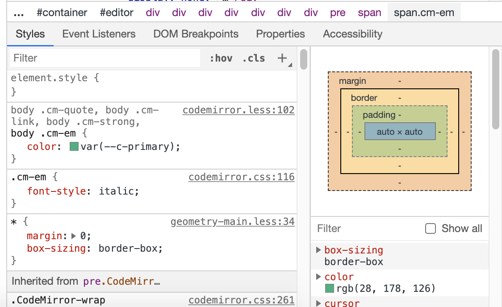
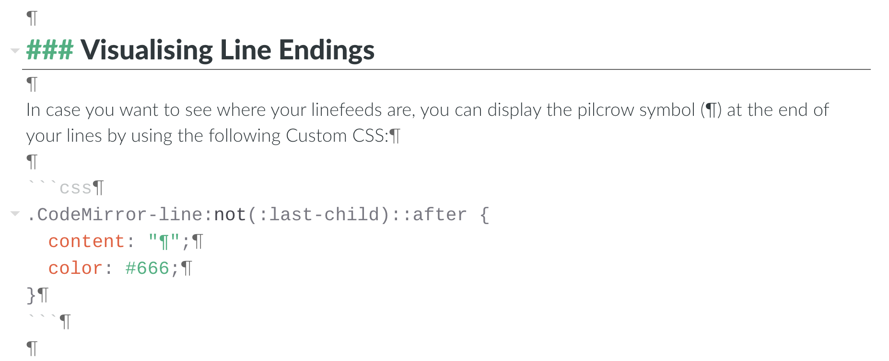

# CSS personalizado

> CSS personalizado es una función para usuarios avanzados. No hay soporte oficial para las personalizaciones y sumercé realizará las personalizaciones bajo su propio riesgo. En caso de que algo salga mal, simplemente puedes eliminar el `custom.css` del directorio de datos de Zettlr para restablecer el CSS personalizado nuevamente.

Es posible utilizar CSS personalizados ([Hojas de estilo en cascada](https://es.wikipedia.org/wiki/CSS)) para modificar la apariencia completa de la aplicación. Puedes encontrar el editor de CSS personalizado en el [gestor de recursos](./ assets-manager.md).

Si no estás familiarizado con los CSS, pero no deseas simplemente copiar y pegar las guías en esta página, puedes optar por seguir un breve [tutorial sobre CSS](https://developer.mozilla.org/en-US/ docs / Learn / CSS / Introduction_to_CSS). Hay muchos en Internet, por lo que una búsqueda rápida en tu motor de búsqueda también puede proporcionarte tutoriales en video, si los prefieres.

<iframe width="560" height="315" src="https://www.youtube-nocookie.com/embed/QcJGI_3adhc" frameborder="0" allow="accelerometer; autoplay; encrypted-media; gyroscope; picture-in-picture" allowfullscreen></iframe>

## Escribir CSS para Zettlr

Los estilos de Zettlr se dividen tanto en geometría como en el tema usado, por lo que es posible que desees seguir cambiando solo el diseño de los elementos _sin_ cambiar **ninguna** geometría. Jugar con la geometría puede ser divertido, pero puede producir un comportamiento completamente aleatorio, ya que algunas partes de la aplicación dependen de los tamaños correctos de los elementos. En caso de que hayas cometido un error, no te preocupes: simplemente elimine el archivo `custom.css` del directorio de datos de Zettlr. Puede encontrar el directorio de datos de tu propio sistema consultando las rutas proporcionadas en [la guía de instalación](../ install.md).

Las clases y los ID en Zettlr siempre tienen un espacio de nombres (_namespace_) para los componentes respectivos (a menos que sean globales), por lo que para anular una regla, tendrás que usar el espacio de nombres completo (también puedes usar la regla de anulación `! Important`, pero esto es ampliamente considerado como una mala práctica).

Todo está siempre en el espacio de nombres del `body`, que tiene una clase` .dark` si la aplicación está actualmente en modo oscuro. Por lo tanto, para asegurarte de que una determinada regla solo se aplique mientras la aplicación está en modo oscuro, asegúrate de agregarle el prefijo `body.dark`.

## Consejos para buscar selectores

Los estilos de Zettlr están sujetos a cambios constantes. Si bien deberían permanecer bastante estables, se pueden introducir cambios en cualquier versión y, por lo tanto, en lugar de proporcionarte ejemplos listos para usar, esta página explica cómo puedes encontrar fácilmente los selectores correctos.

Primero, asegúrate de habilitar el modo de depuración en las [preferencias avanzadas](../ reference / settings.md) para habilitar el menú de Desarrollador. A continuación, abre las herramientas para desarrollo desde este menú y asegúrate de seleccionar la pestaña "Elementos".


Luego haz click en la flecha en la esquina superior izquierda de las herramientas de desarrollo. Ahora puedes hacer click en cualquier elemento de la aplicación para enfocarlo en las herramientas de desarrollo. En el área inferior de las herramientas de desarrollo, verás las directivas CSS utilizadas para diseñar todos los elementos de esta forma en particular.



Las reglas superiores siempre anulan las reglas inferiores, por lo que lo que le interesa es la siguiente directiva:

```css
body .cm-quote, body .cm-link, body .cm-strong, body .cm-em {
    color: var(--c-primary);
}
```

Este es el selector que deberás copiar a tu cuadro de diálogo CSS personalizado para darle un estilo a tu gusto. Como puedes ver, le da a las citas en bloque, enlaces, texto en negrita y cursiva el color principal del tema.

## Fragmentos de código CSS

### Usando una fuente personalizada con Zettlr

En caso de que no te guste la fuente predeterminada que viene con Zettlr, o necesites cambiarla, simplemente pega el siguiente fragmento de código en el editor CSS personalizado. Reemplaza `your-font-name` con el **nombre completo** de la fuente que deseas usar en Zettlr. Reemplaza el "marcador de posición" según la fuente:

- En caso de que desees utilizar una fuente **serif**, como Times New Roman o Georgia, utiliza `serif`
- En caso de que tu fuente sea **sans serif**, como Arial o Helvetica, utiliza `sans-serif`
- En caso de que desees cambiar al clásico **monoespacio**, utiliza el marcador de posición `monoespacio`

El marcador de posición se asegurará de que incluso si no se puede encontrar tu fuente, se utilizará una fuente equivalente. Sirve como alternativa. Además, si el nombre de la fuente contiene espacios, asegúrate de ponerlo entre comillas, por ejemplo, `"Times New Roman"`.

```css
body #editor .CodeMirror {
    font-family: '<tu-nombre-de-fuente aquí>', <placeholder>;
}
```

### Imágenes de fondo personalizadas

Con el siguiente código, puedes hacer que tu editor tenga una imagen de fondo diferente cada vez que lo inicies. Las imágenes están tomadas de Unsplash.com, un buen sitio con fotos gratis. Utiliza la `API de origen`, que simplemente arrojará una imagen diferente cada vez que se visite la URL. ¡Puedes probarlo simplemente [visitando la página y actualizándola varias veces](https://source.unsplash.com/random)! Consulta la [Referencia de API de Unsplash Source](https://source.unsplash.com/) para obtener más opciones (como usar una imagen del día).

> También puedes usar una imagen local como imagen de fondo reemplazando la línea correspondiente por `background-image: url ('file:////ruta/absoluta/a/tu/archivo.jpg');`

```css
/* Enter your custom CSS here */

#editor {
    background-color: transparent;
    background-image: url('https://source.unsplash.com/random');
    background-size: cover;
    background-position: center center;
}

body #editor .CodeMirror-sizer, body #editor .CodeMirror-gutter {
    background-color: rgba(255, 255, 255, .8);
    height: 100%;
}

body.dark #editor .CodeMirror-sizer, body.dark #editor .CodeMirror-gutter {
    background-color: rgba(0, 0, 0, .8);
}

#editor .CodeMirror {
    background-color: transparent;
}
```


### Visualización de finales de línea

En caso de que desees ver dónde están tus saltos de línea, puedes mostrar el símbolo de pilcrow (¶) al final de sus líneas utilizando el siguiente CSS personalizado:

```css
.CodeMirror-line:not(:last-child)::after {
  content: "¶";
  color: #666;
}
```



### Ocultar la barra de herramientas en el modo libre de distracciones

Algunas personas prefieren que el modo sin distracciones sea _realmente_ libre de distracciones. Zettlr no oculta la barra de herramientas de forma predeterminada, porque la mayoría de la gente quiere tener acceso a todas las herramientas y botones incluso cuando escribe sin distracciones. Aún así, si perteneces al grupo de personas que prefieren la ausencia de distracciones para tener solo el editor, ¡regocijáos! ¡Ocultar la barra de herramientas en modo libre de distracciones es tan fácil como una sola línea de CSS!

Simplemente pega la siguiente línea de CSS en el cuadro de diálogo CSS personalizado y, a partir de ese momento, la barra de herramientas siempre estará oculta:

```css
body.show-menubar #editor.fullscreen, #editor.fullscreen, .CodeMirror-fullscreen {
  top: 0px;
}
```

### Establecer un ancho máximo para el texto

Si tiene una pantalla grande, es posible que las líneas de tu texto sean muy largas. Si desea tener líneas más cortas en el editor, con márgenes en ambos lados, puede usar el siguiente fragmento de CSS:

```css
#editor {
  --side-margin: calc( 50vw - 30em ); 
}

#editor .CodeMirror {
  margin-left: var(--side-margin);
}

#editor .CodeMirror-scroll {
  padding-right: var(--side-margin);
}
```


### Cambiando el estilo de línea activa en el modo de máquina de escribir

Puedes cambiar el estilo de la línea activa en el modo de máquina de escribir. Reemplace `top-border-hex-code`,` bottom-border-hex-code` y `background-hex-code` en los fragmentos CSS a continuación con tus códigos de color hexadecimales preferidos, que puedes elegir en un sitio web como [ Códigos de color HTML](https://htmlcolorcodes.com/). Es posible que desees tener un estilo de color diferente para el modo claro y oscuro.

*Light mode*

```css
body #editor .CodeMirror .CodeMirror-linebackground.typewriter-active-line, body .quicklook .body .CodeMirror .CodeMirror-linebackground.typewriter-active-line, body .dialog .CodeMirror .CodeMirror-linebackground.typewriter-active-line {
  border-top: 1px solid <top-border-hex-code>;
  border-bottom: 1px solid <bottom-border-hex-code>;
  background-color: <background-hex-code>;
}
```

*Dark mode*

```css
body.dark #editor .CodeMirror .CodeMirror-linebackground.typewriter-active-line, body.dark .quicklook .body .CodeMirror .CodeMirror-linebackground.typewriter-active-line, body.dark .dialog .CodeMirror .CodeMirror-linebackground.typewriter-active-line {
  border-top: 1px solid <top-border-hex-code>;
  border-bottom: 1px solid <bottom-border-hex-code>;
  background-color: <background-hex-code>;
}
```
