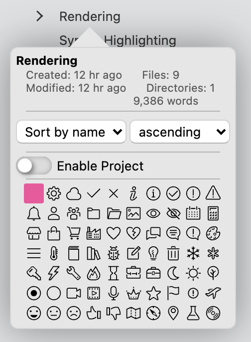

# El gestor de archivos

El administrador de archivos es básicamente un Explorador integrado (o Finder, si está en una Mac) adaptado a las necesidades de Zettlr. Es uno de los componentes principales de la aplicación.

## Generalidades

En las preferencias, puede elegir el modo de administrador de archivos:

* **Expandir**: En el modo extendido, tanto el archivo _árbol_ como el archivo _lista_ serán visibles. El árbol de archivos no muestra archivos individuales (excepto archivos independientes).
* **Combinar**: En el modo combinado, solo verá el árbol de archivos que luego también incluirá archivos.
* **Comprimir**: en el modo comprimido, tiene acceso tanto al árbol de archivos como a la lista de archivos, pero solo se mostrará uno a la vez.

El modo Comprimido se permiten varias formas de alternar entre su árbol de archivos y la lista de archivos. Si actualmente ve el árbol de archivos, pero desea ver la lista de archivos, simplemente haga click en cualquier directorio. Zettlr luego cambiará a la lista de archivos, mostrándote todos los archivos dentro de ese directorio. Si actualmente ve la lista de archivos, simplemente mueva el mouse sobre el área superior de la lista de archivos. Aparecerá una flecha en la que puede hacer clic para volver al árbol de archivos.

Si tiene un trackpad o un mouse que admita el desplazamiento horizontal, también puede hacer uso del desplazamiento horizontal para cambiar de un lado a otro, que en muchos casos es mucho más rápido que hacer clic en algún lugar.

> **Nota**:  Por favor consulte el [manual de configuración](../ reference / settings.md) para obtener más información sobre los modos del gestor de archivos. 

## La lista de archivos

La lista de archivos muestra todos los directorios y archivos dentro del directorio que está seleccionado actualmente en la vista de árbol, pero no como un navegador de archivos normal: **la lista de archivos trata todos los subdirectorios como iguales y los muestra todos uno tras otro.** Por lo tanto, no es necesario que se adentre más en el árbol de directorios para llegar a los directorios ocultos.

Si desactivó la metainformación, tanto los directorios como los archivos se mostrarán como una sola línea. Si muestra la *información del archivo*, verá información adicional: los directorios le mostrarán la cantidad de archivos y carpetas que contienen. Los archivos, por otro lado, muestran su última fecha de modificación, cualquier etiqueta, una identificación y más.

> Puedes alternar la información del archivo a través del menú "Ver", presionando `Cmd / Ctrl + Alt + S`, o la configuración relevante en el cuadro de diálogo de preferencias en la pestaña General

Además, puedes recorrer el árbol de directorios dentro de la lista de archivos haciendo clic en los directorios. Un simple click seleccionará el directorio y se moverá más abajo en el árbol, mientras que `Alt + Click` seleccionará su directorio principal. Esto es útil si tiene que cambiar de directorio con frecuencia, pero prefieres el modo delgado de la barra lateral y no deseas cambiar a la vista de árbol repetidamente.

> Dentro del administrador de archivos, puedes realizar la mayoría de las acciones que también puede realizar en tu Explorador / Finder / navegador de archivos como lo esperarías, como abrir, duplicar, crear y eliminar archivos, arrastrarlos y más.

### Propiedades de archivo y carpeta

Cada archivo y cada carpeta también tienen propiedades. Puedes verlos haciendo click con el botón derecho en cualquier archivo o carpeta y eligiendo el elemento de menú correspondiente.

Cada carpeta se puede convertir en un [Proyecto](../ academic / projects.md) haciendo clic en el interruptor en su ventana emergente de propiedades. Luego, puedes ajustar la configuración del proyecto. Además, puedes seleccionar un icono de directorio que facilita la identificación visual del directorio. Por último, puedes ordenar directorios en tus ventanas emergentes de propiedades. Los archivos, por otro lado, te muestran sus etiquetas, ID y otra información útil. También puede establecer objetivos de escritura en las propiedades de un archivo.

> Para eliminar el objetivo de escritura de un archivo, simplemente establece el contador de escritura en cero.

Los elementos emergentes de propiedades de archivo y carpeta te muestran información general, como la hora de la última modificación, su hora de creación y su tamaño.

## Implicaciones estructurales para la lista de archivos

Cada vez que seleccionas un directorio, la lista de archivos mostrará _todos_ los archivos y carpetas de este directorio. En pocas palabras, aplana todos sus diferentes subdirectorios y archivos de la estructura en forma de árbol que se asemeja al árbol de archivos en una lista unidimensional. La lista siempre cambiará su contenido cada vez que seleccione un directorio diferente en la vista de árbol.

> La lista solo muestra todos los directorios y archivos _dentro_ del directorio seleccionado actualmente. Por lo tanto, funciona un poco como una función de búsqueda muy rápida. Solo ve los archivos en un directorio específico y, cuando bajas de un nivel a otro, cada vez menos archivos son visibles hasta que solo un directorio y sus archivos son visibles. Dada una buena estructura dentro de su raíz, esta es una forma poderosa de tener solo aquellos archivos en la lista que realmente necesitas.

A medida que la lista de archivos aplana su complejo árbol de directorios, debes hacer algunas suposiciones sobre cómo _visualizar_ adecuadamente los archivos. Por lo tanto, las siguientes reglas le ayudarán a distinguir dónde están realmente presentes los archivos en su disco:

1. El directorio seleccionado actualmente estará en la parte superior de la lista de archivos. Siempre.
2. Todos los archivos que están dentro de este directorio se colocan directamente debajo de este nombre de directorio.
3. Todos los subdirectorios que están _dentro_ de este directorio siempre estarán al final de la lista de archivos, es decir, _después_ de los archivos en el directorio seleccionado.
4. Si los directorios están vacíos, se colocarán inmediatamente uno después del otro sin archivos intermedios.

Entonces, lo que es importante recordar es: Todos los directorios se mostrarán como si estuvieran en el mismo nivel; como si no estuvieran anidados. Para identificar qué directorios contienen cuál, consulta la vista de árbol.

> Si no te gusta la clasificación "natural" de Zettlr (de modo que 10 venga después de 2), puede cambiar a la clasificación "ASCII" en la pestaña General del cuadro de diálogo de configuración (de modo que 2 venga después de 10).
