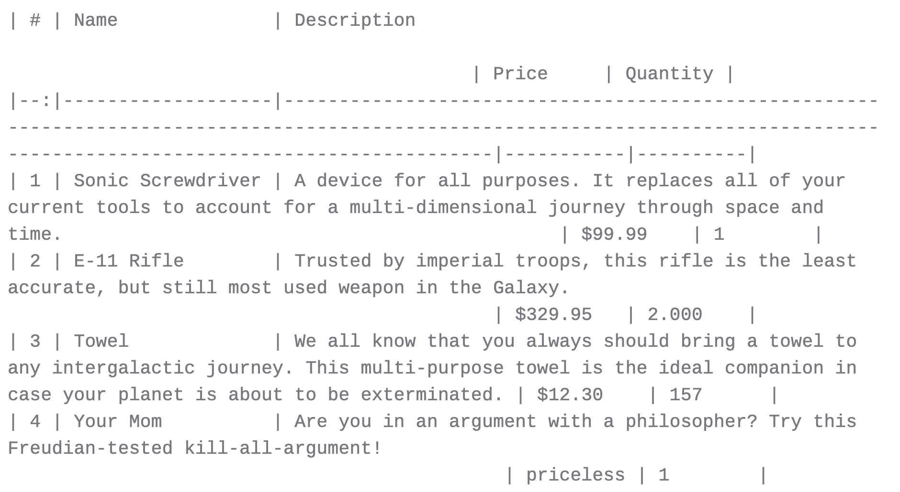
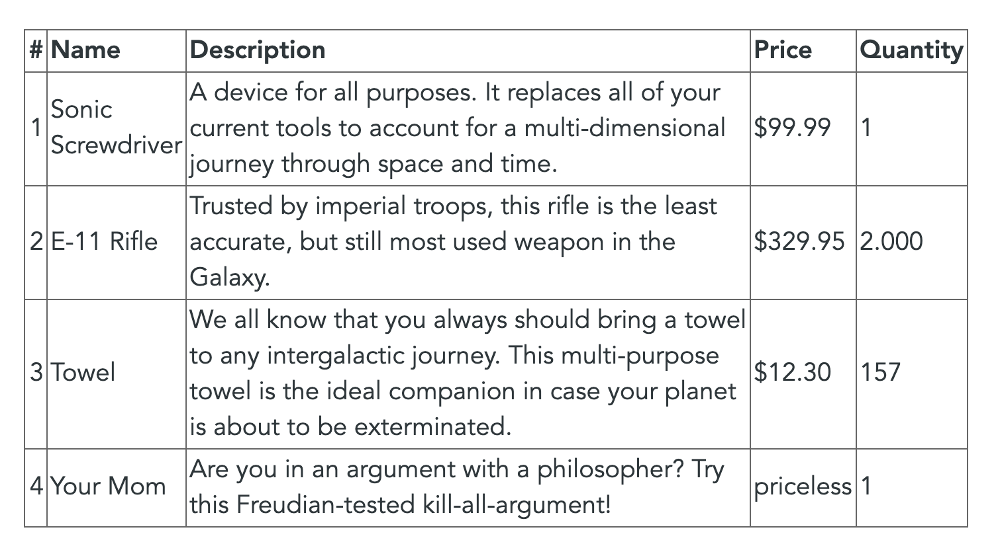
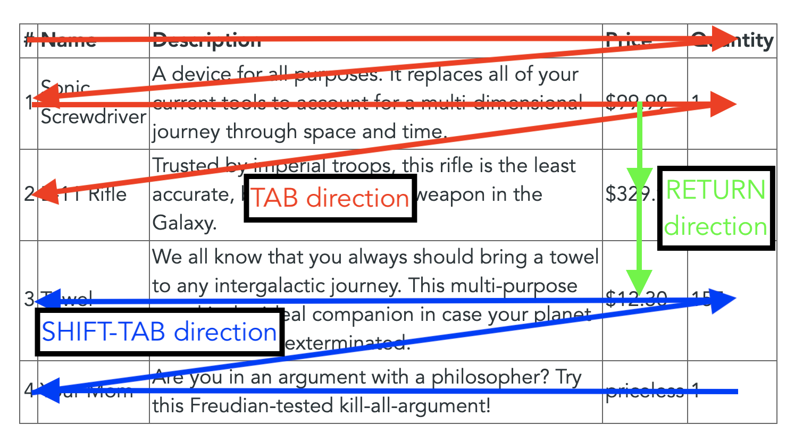

# Tablas en Zettlr

Las tablas de markdown son algo notoriamente difícil. Debido a la naturaleza de Markdown para ser lo más simple posible, la complejidad es lo que peor se le da. Markdown es la elección perfecta para escribir texto y la mayor parte de lo que usamos durante la escritura (por ejemplo, enlaces, imágenes, títulos o citas) se maneja perfectamente en Markdown. Sin embargo, de vez en cuando, también queremos incluir algunos datos en nuestros trabajos, o las tablas son simplemente una mejor forma de visualizar ideas.

## Introducción a las tablas

Las tablas en Markdown están escritas usando una sintaxis muy básica: cada línea se asemeja a una fila y las celdas de la tabla están encapsuladas con caracteres de barra vertical:

```
| Celda A:A | Celda A:B |
| Celda B:A | Celda B:B |
```

Opcionalmente, también puede agregar una fila de encabezado, que también puede indicar la alineación con dos puntos (izquierda, derecha o centro):

```
| Alineado a la izquierda | Contenido centrado | Alineado a la derecha |
|--------------|:----------------:|--------------:|
| Lorem        | Ipsum            | Dolor         |
```

Tenga en cuenta que no importa cómo alinee el contenido de la tabla en sus documentos, siempre que los dos puntos se coloquen en consecuencia. La tabla se exportará con la alineación correcta más adelante.

Pero como puede ver, incluso con solo dos palabras por columna, la tabla de Markdown tiende a ser bastante larga. Como no puede usar varias filas para las celdas, aquí es donde tiende a tener serios problemas cuando necesita insertar una oración completa en cada celda. Tomemos, por ejemplo, esto:

```
| # | Name              | Description                                                                                                                                                                     | Price     | Quantity |
|--:|-------------------|---------------------------------------------------------------------------------------------------------------------------------------------------------------------------------|-----------|----------|
| 1 | Sonic Screwdriver | A device for all purposes. It replaces all of your current tools to account for a multi-dimensional journey through space and time.                                             | $99.99    | 1        |
| 2 | E-11 Rifle        | Trusted by imperial troops, this rifle is the least accurate, but still most used weapon in the Galaxy.                                                                         | $329.95   | 2.000    |
| 3 | Towel             | We all know that you always should bring a towel to any intergalactic journey. This multi-purpose towel is the ideal companion in case your planet is about to be exterminated. | $12.30    | 157      |
| 4 | Your Mom          | Are you in an argument with a philosopher? Try this Freudian-tested kill-all-argument!                                                                                          | priceless | 1        |
```

En Zettlr, se vería así:




A pesar de que las celdas de la tabla están alineadas para ajustarse al ancho total de cada columna, no puede distinguir el hecho de que esta es una tabla Markdown válida, ya que cada línea se ajusta y la estructura de la tabla es imposible de ver. Sin el contador en la primera columna, incluso le resultaría difícil distinguir el número de filas que contiene.

## El editor de tablas

Obviamente, escribir tablas de Markdown es a veces inevitable, pero siempre jodido. Sería genial si pudiera simplemente editar la tabla como está acostumbrado, por ejemplo, en procesadores de texto, ¿verdad? ¡Ahí es donde entra en juego el **editor de tablas** integrado de Zettlr!

Para ayudarlo a escribir tablas, Zettlr viene con un poderoso editor de tablas que le brinda todo lo que necesita para no perder la cabeza por completo mientras crea tablas en sus documentos. Con el editor de tablas, la tabla mencionada anteriormente se ve así:



Mucho mejor, ¿verdad? El editor de tablas de Zettlr toma todas las tablas de Markdown que se encuentran en su documento, las convierte en una representación HTML con celdas de contenido editables y las muestra en lugar del Markdown subyacente. Esto oculta completamente la fuente de Markdown, pero en este caso este enfoque es mucho más favorable que el [enfoque LQVELQQD](../conceptos/wysiwym.md).

El editor de tablas debe estar habilitado en Preferencias, en la pestaña `Editor`. Cuando está habilitado, reconocerá las tablas en el documento activo y las hará fácilmente editables. Puede **ingresar al modo de edición** simplemente haciendo click en cualquiera de las celdas dentro de la tabla y agregando su contenido. La celda activa se resaltará para usted. Además, la navegación con el teclado que conoce de los procesadores de texto famosos también se implementó para que pueda usar `Tab`,` Return` y las teclas de flecha para navegar por la tabla. Además, también es posible agregar y eliminar columnas y filas con los **botones de borde** del editor de tablas. Estos son botones que aparecerán cuando se desplaza sobre la tabla y le permiten realizar varias acciones sobre la tabla.

> ¡Atención! Cuando activa la tabla haciendo clic dentro de una de las celdas, está ingresando al modo de edición. Para guardar sus cambios, asegúrese de **hacer click fuera de la tabla una vez que haya terminado**, para salir del modo de edición. Solo entonces los cambios que ha realizado en la tabla se aplicarán a la tabla de Markdown subyacente.

## Navegación por teclado

Tienes los siguientes atajos a tu disposición:

- `Tab`: Para pasar a la siguiente celda. Si la última columna está activa, se mueve a la primera celda de la siguiente fila. Si su cursor estaba en la última columna de la última fila, se agregará una nueva fila automáticamente.
- `Shift-Tab`: Para ir a la celda anterior. Si su cursor estaba en la primera columna, lo mueve a la última celda de la columna anterior.
- `Return`: Va a la misma columna en la siguiente fila. Si su cursor estaba en la última fila, se agregará una nueva fila automáticamente.
- `Flecha arriba/abajo`: Se mover a la misma columna en la fila anterior / siguiente. No se agregarán nuevas filas si está en la primera o en la última fila.
- `Flecha izquierda/derecha`: Para mover el cursor hacia la izquierda / derecha. Si el cursor está al principio / final del contenido de la celda, mueve a la celda anterior / siguiente.

Con estos atajos, puede ingresar contenido fácilmente en sus tablas usando movimientos naturales. Primero querrá completar el encabezado de la tabla y luego querrá agregar un conjunto de datos por línea. Por lo tanto, `Tab` es tu amigo aquí:



## Los botones de borde

Otro beneficio del editor de tablas son sus llamados **botones de borde**. Estos son dos grupos de botones y cuatro botones de dirección que aparecerán una vez que pase el mouse sobre una tabla:


Son transparentes al principio para no tapar el contenido de tu tabla. Mueve el cursor sobre un botón de borde para hacerlo opaco. Los botones deberían ser bastante autoexplicativos. Los cuatro botones `(+)` en el centro de los bordes de la tabla **agregarán una fila o columna respectivamente** en la posición indicada. Por lo tanto, haga click en el botón Agregar de la izquierda para anteponer una columna al lado izquierdo de la celda actualmente activa, y haga click en el botón Agregar inferior para agregar una fila debajo de la celda actualmente activa.

En la parte superior de cada tabla, hay dos grupos de botones adicionales. El grupo de botones de la izquierda contiene tres botones que **alinean la columna de la tabla actualmente activa** izquierda, centro o derecha. Haga clic en uno de los botones para aplicar la alineación. El cambio se mostrará inmediatamente para su confirmación visual.

El grupo de botones de la derecha contiene dos botones para **eliminar la fila o columna de la tabla actualmente activa**. Simplemente coloque el cursor dentro de cualquier celda dentro de la fila o columna que desea eliminar y presione uno de los botones.

> Asegúrese siempre de colocar el cursor en la celda correcta antes de eliminar columnas o filas para evitar la maluquera de tener que salir de la edición de tablas y aplicar el comando "Deshacer".


## Tablas complejas

Hasta ahora solo hemos cubierto tablas básicas. Pero, ¿y si necesita mostrar tablas más complejas? Entonces, incluso el editor de tablas está al final. Las celdas que abarcan varias filas o columnas son simplemente imposibles dada la sintaxis limitada de las tablas de Markdown. Para agregarlos, tendrá que usar comandos nativos HTML o LaTeX. Estos le brindan la máxima libertad para hacer lo que quiera.

Recuerde siempre: las tablas en Markdown se utilizan como _ayuda_ a su _escritura_. Esto significa que si está tratando con conjuntos de datos complejos que necesita agregar a un documento, por ejemplo, en la sección de fuentes, existen excelentes herramientas para [transformar su RDataset](https://tex.stackexchange.com/questions/364225/export-tables-from-r-to-latex) o archivo de datos Stata en LaTeX o HTML.

Una idea para insertar conjuntos de datos en sus documentos sin  copiar y pegar en exceso sería combinar varias características de Zettlr:

- Crea un proyecto para tu artículo
- Cree los archivos necesarios para estructurar su trabajo (por ejemplo, `01-Capitulo1.md`,` 02-Capitulo2.md`, `03-Capitulo3.md`,` 04-Capitulo4.md`)
- Dentro de su proyecto de R o Stata, agregue un comando que exporte sus datos a un archivo `05-Datos.md` en el directorio de su proyecto cada vez que algo cambie.
- Tan pronto como exporte su artículo, el archivo administrado externamente `05-Datos.md` se agregará automáticamente, asegurándose de que sus datos se envíen con su documento.
