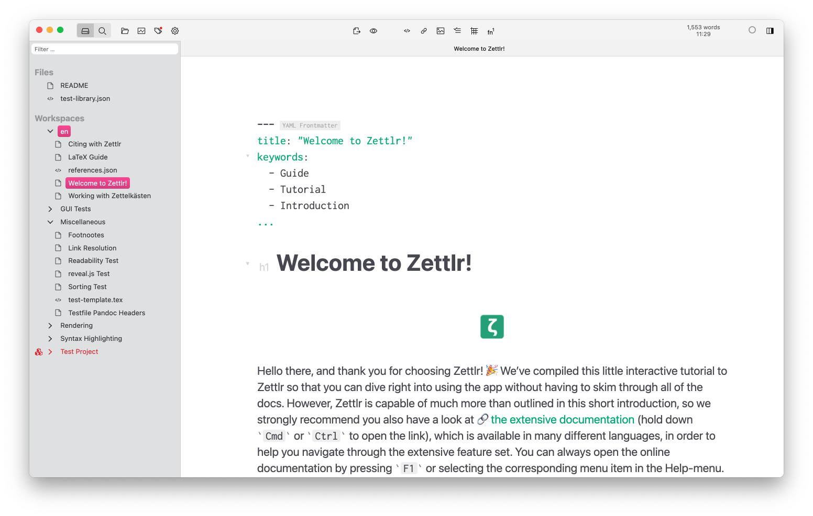

# Empezando

Después de configurar  Zettlr, podrías querer empezar inmediatamente con él.  En su primer arranque, Zettlr copiará un directorio especial en su carpeta de  Documentos que contiene un muy útil tutorial interactivo que te lleva por  los primeros pasos de la aplicación de forma nativa. Solo sigue las instrucciones allí; que incluso te llevará a secciones específicas de esta documentación donde puede aprender más de esta app.

Si tiene cualquier pregunta que no parece estar contestada en esta documentación, asegúrese de consultar las  [Preguntas frecuentes](faq.md) y preguntarle a la comunidad en  [Reddit](https://www.reddit.com/r/Zettlr/), [Discord](https://discord.com/invite/PcfS3DM9Xj)y [las discusiones de GitHub](https://github.com/Zettlr/Zettlr/discussions). También tenemos un  [Canal de YouTube](https://www.youtube.com/c/Zettlr/) donde ocasionalmente subimos videos sobre cómo usar la app y sus herramientas asociadas.

Puedes ver una serie de videos introductorios siguiendo [este enlace a nuestra lista de reproducción de Cómo hacer en  Zettlr](https://www.youtube.com/playlist?list=PL2ydvDwV-1u5ncnkxQWZhbHQdwpY2fx5f).

> El tutorial interactivo sugerirá instalar LaTeX en su computador. Zettlr depende de LaTeX para la exportación avanzada de PDFs. Sin LaTeX sólo será capaz de hacer la exportación básica de PDFs. Si no necesita la exportación avanzada de  PDFs, no necesitará LaTeX. Puede ser instalado en cualquier momento, en caso de que cambie de parecer.

Todas estas características usadas en este tutorial se describen en esta documentación, así que en caso de que quiera leer más sobre ellas, simplemente busca la característica que necesitas aquí. Se recomienda que sigas el tutorial durante tu primer arranque de la aplicación para acostumbrarse a diferentes conceptos como la barra lateral, el árbol de archivos, los enlaces internos y las pestañas de documentos.

Una vez que hayas terminado el tutorial, puedes o bien cerrar el directorio o eliminar la carpeta de la app o del computador y abrir una nueva carpeta para trabajar con ella.
