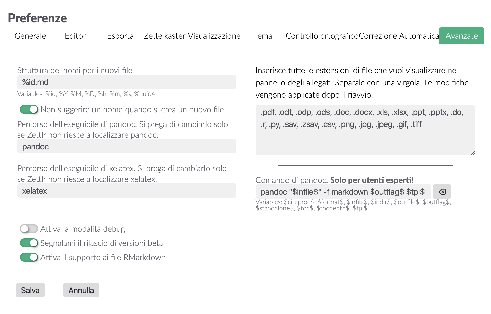

# Esportare in Zettlr

Esportare i file è un'importante interfaccia tra i tuoi appunti e le altre persone. Con l'opzione di esportazione, potrai:

1. Visualizzare un file in anteprima, per esempio in HTML, e anche stamparlo. (Stampare una nota usando `Cmd/Ctrl+P` internamente significa esportare a HTML.)
2. Esportarlo in un formato su cui altre persone possano lavorarci, come Word o file di OpenDocument
3. Esportarlo in PDF per inviarlo (come ad esempio i materiali di un seminario), o anche stamparlo

## Preparazione all'esportazione

Tutte le esportazioni in Zettlr sono effettuate usando i pacchetti software liberi Pandoc e LateX. Pandoc è necessario per tutte le esportazioni, perché sarà il primo a convertire qualsiasi cosa. LaTeX è necessario solo per le esportazioni in PDF. 

> Se Pandoc non è installato sul tuo sistema, potrai ancora esportare in HTML. In quel cas, Zettlr procederà internamente alla scomposizione del file usando `Showdown.js`, ma questa libreria non supporta tante funzionalità come Pandoc. Ti preghiamo di consultare la [guida di configurazione](../install.md) per installare Pandoc e LaTeX sul tuo computer.

Zettlr farà del suo meglio per individuare entrambi i pacchetti. Se il programma non riesce a localizzare i file binari, mostrerà un errore. 

**Nel caso tu abbia installato entrambi i pacchetti, ma Zettlr ancora non riuscisse a esportare**, dai un'occhiata alle tue Preferenze. Nel pannello "Avanzate", ci sono due campi di testo che ti consentono di inserire i percorsi all'eseguibile di Pandoc e all'eseguibile di XeLaTeX. Basta inserirli, riavviare, e a quel punto dovrebbe funzionare. In caso contrario, faccelo sapere!

## Opzioni di esportazione

A partire dalla versione `0.17`, Zettlr ti mette a disposizione una pletora di opzioni per esportare i documenti secondo le tue necessità. Sono divise in due diverse finestre. Le opzioni generali di esportazione si trovano nella finestra delle preferenze. Aprila, e apri il pannello "Esporta". Troverai due sezioni che ti consentono di personalizzare le esportazioni. Per prima cosa, seleziona in quale cartella desideri salvare i file risultanti.

- Selezionare la cartella temporanea farà si che Zettlr salvi i documenti esportati nella cartella temporanea. La cartella temporanea è una cartella speciale presente in tutti i sistemi operativi utilizzata per i file temporanei ed è pulita non appena il file non è più necessario. È una buona cosa se non vuoi archiviare file esportati da qualche parte nel tuo sistema. Se esporti i tuoi file nella cartella temporanea, dovrai esplicitamente salvarli da qualche altra parte per non perderli.
- Scegliere la cartella attualmente aperta (cwd) farà esportare a Zettlr i tuoi documenti esportati nella cartella attualmente aperta. In questo modo, non dovrai salvare esplicitamente i tuoi file fuori dalla cartella temporanea per renderli permanenti. **Ti preghiamo di notare che il motore di esportazione non ti chiederà conferma quando sovrascrivi un file!**

La seconda sezione comprende opzioni per istruire Zettlr su cosa fare degli elementi di Zettelkasten che supporta. Se vuoi sapere a cosa servono questi elementi, consulta la [sezione corrispondente della guida](../academic/zkn-method.md). Questa sezione ti consente di mantenere oppure rimuovere questi elementi al momento dell'esportazione perché nella gran parte dei casi sono utili e necessario solo all'interno del programma, e non dovrebbero apparire nei documenti esportati. 

Una seconda sezione che contiene le preferenze per l'esportazione si trova nella finestra `Preferenze PDF`. Puoi aprirla usando il menu (si trova subito sotto la voce del menu delle normali preferenze) oppure usando i tasti `Cmd/Ctrl+Alt+,`. Questa finestra di dialogo riguarda soltanto l'esportazione in PDF. Puoi scegliere tra un sacco di opzioni, quali il formato della carta, i margini di pagina, il carattere o la dimensione del carattere, se vuoi o meno i numeri di pagina e, se sì, quali. La gran parte delle opzioni di esportazione sarà intuitiva e somiglierà a quelle presenti nei normali editor di testo. 
