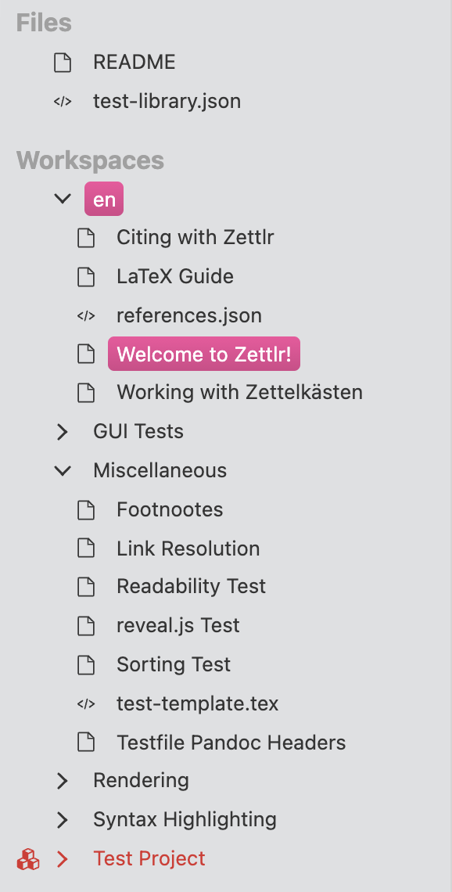

# ワークスペースとファイル

Zettlrは、専用に作られたファイルシステム抽象化レイヤー(FSAL)に基づいた完全なファイルマネージャーを内蔵しています。Zettlrは、作業に没頭できることを基本理念としているので、これは必然的なものです。実際にZettlrを使う際には、コンピュータ内のいずれかのフォルダを選択して、その中でほとんどの作業を行うことになります。

<iframe width="560" height="315" src="https://www.youtube-nocookie.com/embed/2YX5n8-XVbU" frameborder="0" allow="accelerometer; autoplay; encrypted-media; gyroscope; picture-in-picture" allowfullscreen></iframe>

> このドキュメンテーション全体で言えることですが、「フォルダ」と「ディレクトリ」という語は、同じものを意味しています。「フォルダ」という語は多くの人が知っていると思いますが、それに対して「ディレクトリ」はフォルダを意味する専門用語です。

## ワークスペース

ワークスペースは、一つのファイルツリーの基礎となるものです。ご存知かと思いますが、ファイルはコンピュータ内のフォルダの階層構造に格納されています。Zettlrで開いたディレクトリはワークスペースと呼ばれます。

複数のルートワークスペースを同時に開いておくこともできます。異なる作業のまとまりごとに、例えば「Zettelkasten」と「Projects」という名前のワークスペースに分けておくことができます。ドキュメント管理のPARAメソッドを実践したいなら、「Projects」、「Archive」、「Resources」、「Areas」という4つのディレクトリを作って、それぞれワークスペースとして読み込むのが理にかなっています。

Zettlrは、ワークスペース以下のすべてのファイルが外部で変更されていないかを監視しています。例えば、Google Drive、Dropbox、Nextcloudなどのクラウドサービスを使ってファイルをバックアップしている場合、Zettlrの起動後にクラウドアプリケーションがファイルの変更を同期する可能性があります。Zettlrはそれを認識して、ファイルの変更を適切にアプリケーションに反映します。

> 少なくとも1つのワークスペースを開いておくことを強く推奨します。コンピュータ上の単独のファイルを開いて作業を行うことも可能ですが、おすすめはしません。そのような使い方では、ワークスペースに関連した多くの機能が使用できなくなってしまいます、またZettlrのコンセプトから外れた使い方であるため、生産性の低下が予想されます。

## 単独ファイル

単独ファイルとは、コンピュータ上でダブルクリックするなどして開いたファイルで、開いているワークスペースのいずれにも属していないものです。それ自体はZettlrのファイルツリーに表示されますが、ワークスペースとは異なり、そのファイルのみでツリーが完結しています。

アプリケーション内の操作でファイルを直接開くことはできません。その代わり、コンピュータ上のどこかでファイルをダブルクリックした際に開かれることがあります。そのファイルがいずれかのワークスペースに含まれていれば、単にそのワークスーペースに移動して該当のファイルを表示します。しかし、ファイルがZettlrのワークスペースのいずれにも含まれないものであれば、そのファイルは単独ファイルとして開かれます。

単独ファイルは常にワークスペースより上に表示され、簡単に見つけることができます。ファイルを閉じると、アプリケーションから取り除かれてファイルはそのまま残ります。ファイルを削除すると、アプリケーションから取り除かれ、さらにゴミ箱に移動されます。

> この動作により、いずれのワークスペースにも属していないMarkdownファイルをアプリケーションに簡単に読み込むことができます。例えば、ソフトウェア開発者がプロジェクトのReadmeファイルを編集するのに、ディレクトリ全体をZettlrに読み込ませる必要がありません。
