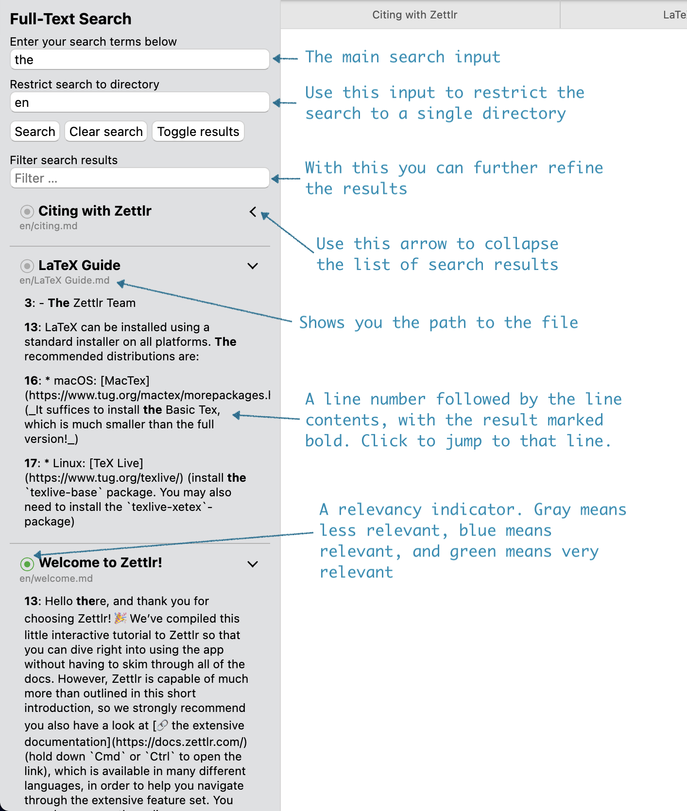

# 検索

文章を書くためにMarkdownを使うことの大きな利点として、オペレーティングシステムに内蔵された検索システム(Windowsのコルタナ、macOSのSpotlight、LinuxのDashなど)を使って検索可能であることが挙げられます。しかし、プログラムを離れずに何かを探すことができれば大変便利です。そこで、検索機能の出番です。Zettlrには、基本的に3つに区別される検索機能があります。左側のリストで異なるディレクトリを選択するたびに動作する高速フィルタリング機能、文書内検索、それから、全文検索です。

## ファイルのフィルタリング

一つ目の機能については、すでに色々なところで述べています。ファイルリストには、現在のディレクトリと、そのサブディレクトリに含まれるファイルのみが表示されます。異なるディレクトリを選択して絞り込んでいくと、すべてのファイルが表示されている状態から、見たいファイルだけが表示された状態にすることができます。あるいは、ワークスペースのルートを選択すれば、すべてのファイルを一覧することができます。

You can also filter this list further using the text field on top of the file list.

## ファイル内検索

現在開いているファイル内で、特定の語句や単語を検索したい場合は、`Cmd/Ctrl+F`を押します。The search will open in the top-right corner of the editor. Just type something and hit `Enter` repeatedly to cycle through the matches. Click the small "x" button to close the search.

> **ヒント**: 強力な正規表現を使って検索することもできます。Zettlrはデフォルトでは、普通の検索を行いますが、正規表現を検出すると(検索文字列が半角スラッシュで囲まれていると)、正規表現検索を行います。Zettlrは正規表現を検出すると、入力しやすいように検索文字列の表示を等幅フォントに変更します。例えば、すべての数字を検索したい場合は、`/\d+/`を検索します。[JavaScriptの正規表現について、さらに知りたい場合はこちら。](https://codeburst.io/javascript-learn-regular-expressions-for-beginners-bb6107015d91)

置換の入力欄で`Enter`を押すと、Zettlrは、現在の検索結果を置換し、次に検索結果が現れる場所を自動的にハイライトします。繰り返し`Enter`を押していくと、複数の個所を置換することができます。すべての検索結果を一度に置換したい場合は、置換の入力欄で`Alt+Enter`を押してください。

> **ヒント**: 他のエディタと同様に、正規表現検索では変数を利用することができます。一つ以上のキャプチャグループを含む正規表現で検索した場合、置換文字列中で`$1`といった変数を使うことができます。このような変数は、実際にマッチしたキャプチャグループの文字列で置き換えられます。変数を複数使った場合も、同様に置換されます。`$`の後の数字は、キャプチャグループのインデックスに対応しています(2番目のキャプチャグループは`$2`、などとなります。)[JavaScriptの正規表現について、さらに知りたい場合はこちら。](https://codeburst.io/javascript-learn-regular-expressions-for-beginners-bb6107015d91)

もちろん、Quicklookウィンドウでも検索を行うことができます。検索したいQuicklookをクリックしてから`Cmd/Ctrl+F`を押してください。(クリックしてフォーカスを移動しておかないと、メインウィンドウでの検索になってしまいます。)

## 全文検索

The most important aspect of searching is, in fact, the full-text search which you can open by pressing `Cmd/Ctrl+Shift+F`. The full text search is located where the file manager is and can be opened using the three-way toggle to the left of the toolbar. The full text search provides you with advanced functionality to get to the info you need as fast as possible.

The full-text search features three inputs:

* The **query field** contains the actual search terms you are looking for
* The second input allows you to **restrict your search to a specific directory**
* The last text field is only visible when a search is running, which allows you to **further filter your search results**

### The Search Results

The search results contain a few indicators that help you make sense of where the info is coming from, and what the file actually contains. In the header of each file result you fill first see either the filename, the `title` property, or the first heading of level 1, depending on your settings. Below that, you will always find the full path from the workspace root to the file in question. Furthermore, each search result has a relevancy score (previously the "heatmap"), which tells you how relevant Zettlr thinks this search result is: Gray means less relevant, blue means relevant, and green means very relevant. Lastly, you can collapse the search results of that file by clicking the arrow on the right-hand side.

Each search result will list you all the lines in which your search terms were found. The actual search results are emphasised while the rest of the line is displayed to provide you with the context of the result. In front of each line is the line-number. Upon clicking a single search result line, Zettlr will automatically open the file (if not already done) and jump to the corresponding line.

> Too many results? You can also toggle the display of all results using the corresponding button, and then only expand those which deserve a second look.

### Composing a Query

Composing a query works similar to other search engines which you are already familiar with. You can make use of several different operators to specify exactly what you are searching for:

* **AND演算子:** `Boat Ship`と検索すると、"boat"と"ship"の**両方を**含むファイルのみが表示されます。半角スペースが"AND"と解釈されます。
* **OR演算子:** `Boat | Ship`と検索すると、"boat"と"ship"の**いずれか**を含むファイルが、すべて表示されます。
* **完全一致演算子:** `"Boat Ship"`と検索すると、これに完全一致する文字列を含むファイルを検索します。
* **NOT演算子:** `!Boat`と検索すると、その文字列を**含まない**ファイルのみが表示されます。完全一致検索と合わせて使うこともでき、`!"Boat Ship"`とすると"Boat Ship"に完全一致する文字列を含むファイルが除外されます。

> **注意**: AND演算子、OR演算子、完全一致演算子は結果の重み付けをするような動作をします。つまり、すべての検索条件を満たすファイルは関連性が高いと考えられ、一部の条件のみを満たすファイルは関連性が青もしくはグレーで表示されます。一方で、NOT演算子の条件を満たすファイルは検索結果から完全に除外されます。例えば`boat ship`を検索すると、いずれかの単語のみを含むようなファイルも（低い重み付けで）引っかかるのに対し、`!boat ship`を検索すると"boat"という単語を含むファイルは完全に除外されます。

もちろん、これらの演算子を組み合わせて使うこともできます。`"Boat Ship" | vessel captain`と検索すると、"Boat Ship"または"vessel"を含み、加えて"captain"も含むファイルを検索します。

検索する単語が一部しか思い出せない場合でもご安心ください。Zettlrは、検索文字列を単語の一部に含むものも見つけようとします。つまり、"trooper"を検索すると、"Stormtrooper"や"Troopership"にもマッチします。"Boat Ship"は"Steamboat Ship"にもマッチします。また、**検索は大文字小文字を無視します。**そのため、ちょっとした入力ミスの存在を気にする必要はありません。

Zettlrは検索中、検索欄の右に検索インジケーターを表示します。検索に時間がかかりすぎている場合は、中断することもできます。

より良い結果を得るため、Zettlrは、それぞれの検索の種類ごとに重み付けをしています。例えば、タイトル中に完全一致する文字列を含んでいるなら、そのファイルは非常に関連性が高いことを示していると思われます。したがって、Zettlrは、これを他の一致よりも重視します。同様に、検索結果の大文字小文字が不一致のものよりも、一致しているものに高い点数を付けます。

検索に一致した正確な場所を見つけるには、ファイルを選択してください。すると、自動的にすべての一致箇所が明るい黄色でハイライトされ、簡単に見つけることができます。また、ウィンドウの一番右のスクロールバーにも、文書中の検索結果の位置を示すマーカーが表示されます。
