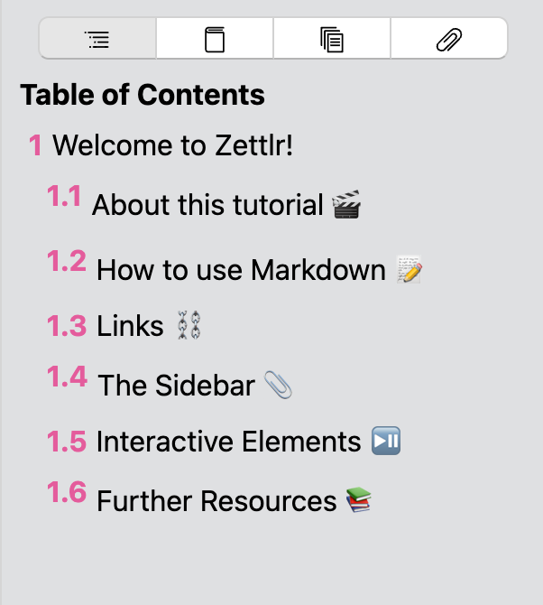
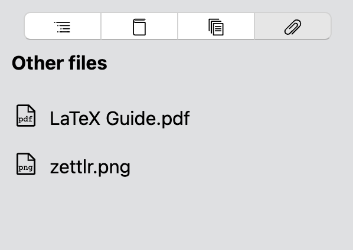

# サイドバー

サイドバーは、現在のディレクトリとファイルに関連する追加情報を表示するコンテキスト依存の要素です。ツールバーのサイドバーアイコンをクリックするか、`Cmd/Ctrl+?`を押すと開くことができます。

> Please note that strictly speaking Zettlr features two sidebars: The sidebar to the left is referred to as the [File Manager](file-manager.md), whereas the right one – this sidebar – is referred to as "the" sidebar.

After you open the sidebar, you can see that it has four tabs. These are (from left to right): Table of Contents, References, Related Files, and other files.

## Table of Contents

The first tab shows you a table of contents for your current file. It gets updated in real time and allows you to see the structure of your document at a glance. The entries within the table of contents also support Markdown elements, so that your headings will be rendered to HTML.

If you click one of these headings, the editor will directly jump to that specific heading. This way, the table of contents works almost exactly like the outline view from Microsoft Word or other text editors you might know.

## References

The references tab contains a bibliography of all the references you cite within the document. It is generated whenever you save your document and gives you a preview of your bibliography section. Links will be rendered clickable so that you can open a related website directly from within the sidebar. You can also select text in this panel which allows you to copy the references.

To learn more about citing references with Zettlr, have a look at the documentation page for [citations](../academic/citations.md).

> Please note that the references will be displayed using the built-in CSL style. During export, however, Pandoc will use whichever style you define in your preferences to match your expectations. The references in the sidebar are for preview purposes.

## Related Files

The related files section has been added in 2.0 and contains files that Zettlr thinks are related to the current file. They are listed by relevancy descending, so the most relevant files will be on top of the list.

Which files are deemed relevant are determined by the tags they use. The more corresponding tags the other file has the more relevant it is for Zettlr. We plan on adding backlinks to the relevancy calculation as well. <!-- TODO: Fix this part as soon as it's implemented! -->

## Other Files

The last section contains files that reside within the currently selected directory but are considered neither Markdown nor one of the supported code files. This could be images, PDF files, Excel spreadsheets, or any other file type which you would like to see there.

You can determine which files are being listed here by adding the file extensions in the advanced preferences tab. Those file extensions are case-insensitive, so adding `.jpeg` will show `.jpeg` files as well as `.JPEG` and `.JpEg`.

> This tab is especially useful if you want to add some images to your Markdown files. Simply drag and drop them onto the editor, and Zettlr will make sure to wrap them in an image tag.

