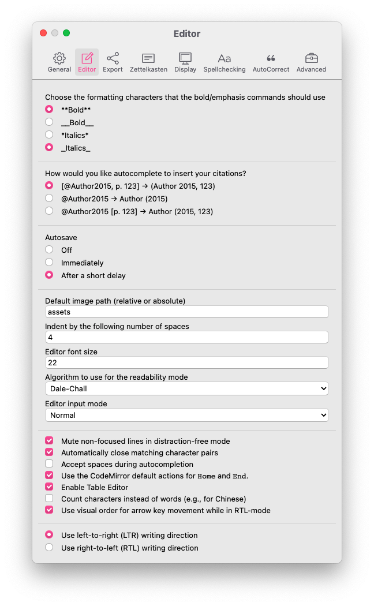
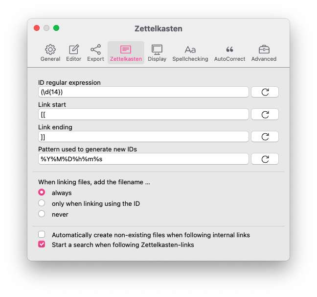
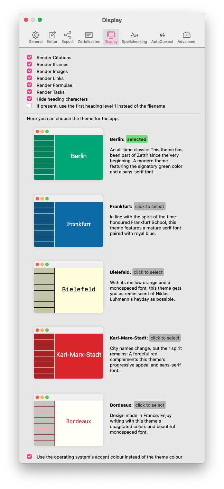
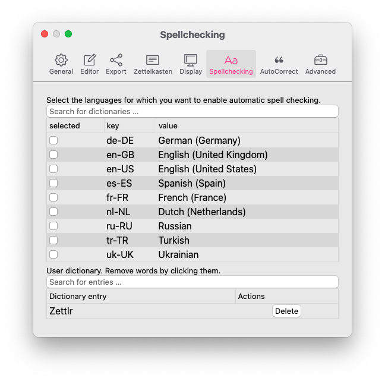

# 設定

Zettlrには、アプリケーションをカスタマイズするための多くの設定項目があります。大きく分けて3つの設定ダイアログがありますが、その内の一つである[アセットマネージャは別のページで解説](../core/assets-manager.md)します。その他に一般設定ダイアログとタグマネージャがあります。

## 一般設定

一般設定ダイアログは`Cmd/Ctrl+,`のショートカットか、ツールバーのボタン(歯車)、メニュー内の対応する項目から開くことができます。ダイアログが表示され、カスタマイズ可能な設定項目が表示されます。設定項目は上部に表示された8つのタブに分かれています。

* [一般](#_3): Zettlr全体に影響する設定です。
* [エディタ](#_4): エディタ自体にのみ関係する設定です。
* [エクスポート](#_5): ファイルをエクスポートする方法についての設定です。
* [引用](#_6): Zettlrで引用を行う方法を制御します。
* [Zettelkasten](#Zettelkasten): ZettelkastenシステムにZettlrを適用するための設定です。
* [表示](#_7): 画像やリンクなどの要素をどのようにエディタに表示するかの設定とアプリケーション表示のテーマを選択します。
* [スペルチェック](#_8): インストール済みの辞書およびユーザ辞書を選択します。
* [オートコレクト](#_9): 自動的に置換する文字列と、使用するクォーテーションの種類を選択します。
* [高度な設定](#_10): 上級者向けの設定です。

### 一般

一般タブには、Zettlrを使い始めるときにユーザのニーズに合わせて設定できる項目が並んでいます。

* **言語**: アプリケーションの表示用言語を設定します。十分な量の翻訳が完了している言語のみ表示されます。変更は再起動後に反映されます。
* **ダークモード**: アプリケーションの表示をダークモードにするかどうか選択します。これは、`Cmd/Ctrl+Alt+L`のショートカットキーで切り替えることもできます。また、スケジュールに従って自動的に切り替えることもできます。
* **ファイル情報を表示**: ファイルリスト（ファイルマネージャーモードがthinかexpandedの場合のみ利用可能）に、タグや執筆目標などのファイルに関するメタ情報を表示するかどうかを選択します。
* **現在のファイルに対する外部での変更を常に読み込む**: Zettlrの外部でファイルが変更された場合に、再読み込みの確認を表示するかどうかを選択します。
* **ファイルを新しいタブで開くことを可能な限り避ける**: デフォルトでは、Zettlrでファイルを開くと必ず新しいタブに表示されます。この設定をオンにすると、新しいタブを開くのではなく現在選択しているタブを置き換えるようになります。マウスの中ボタンクリック、または右クリックメニューを使用して、強制的に新しいタブで開くこともできます。
* **自動的にダークモードに切り替える**:
    * **Off**: ダークモードの自動切り替えを行いません
    * **Schedule**: 指定したダークモードの開始終了時刻に基づいてダークモードを切り替えます
    * **Follow Operating System**: OSのダークモード設定に従います。（Linuxは非対応）
* **ダークモード開始時刻**: 自動的にライトモードからダークモードに切り替える時刻（HH:MM形式）を指定します
* **ダークモード終了時刻**: 自動的にダークモードからライトモードに切り替える時刻（HH:MM形式）を指定します
* **ファイルマネージャーモード**:
    * **Thin**: ディレクトリとファイルを別々に表示します。ディレクトリを選択すると、その中身がファイルリストに表示されます。ディレクトリをクリックするとファイルリストへ、ファイルリストの左上に表示される矢印ボタンをクリックするとディレクトリツリーへ表示が切り替わります。
    * **Expanded**: ディレクトリとファイルを別々に表示しますが、両方が同時に表示されます。ディレクトリをクリックすると、その中身がファイルリストに表示されます。
    * **Combined**: ファイルツリーにディレクトリとファイルを一緒に表示します。このモードではファイルリストは使用できません。
* **ファイルの表示方法**:
    * **ファイル名のみ**: 各ファイルのファイル名を常に表示します。タイトル、レベル1の見出しは使用されません。
    * **タイトル(存在する場合)**: ファイルにYAML frontmatterのタイトルがあれば、それを表示します。無ければファイル名を表示します。
    * **最初のレベル1の見出し(存在する場合)**: ファイルに最初に現れるレベル1の見出しを表示します。無ければファイル名を表示します。
    * **タイトルまたは最初のレベル1の見出し(存在する場合)**: ファイルにYAML frontmatterのタイトルがあれば、それを表示します。無ければ、最初に現れるレベル1の見出しを表示します。どちらも無ければファイル名を表示します。
* **Markdownファイルの拡張子を表示する**: デフォルトでは、Markdownファイルの拡張子(例えば`*.txt`、`*.md`、`*.markdown`)は表示されません。この設定をオンにすると拡張子を表示することができます。
* **ファイルの並び順(名前で並べ替える際に使用)**:
    * **数値順(2→10の順番)**: この設定を選択すると、2の後に10が来るような論理的な順番にファイルを並べます。2の前に0を付けていなくてもこのような動作になります。
    * **ASCII順(10→2の順番)**: この設定を選択すると、ファイル名が1文字ずつ比較されます。2は1の後に来るので、2が10の後に並びます。2を10の前に並べたい場合は、前にゼロをつけて02とする必要があります。
* **フォルダをファイルより上に表示する**: デフォルトでは、まずファイルが表示され、その後にフォルダが並びます。この設定を有効にすると、フォルダが先に表示されるようになります。設定を有効化するには再起動が必要です。
* **時刻で並べ替える際に使用する項目**:
    * **最終更新日時**: ファイルを最後に編集した日時で並べ替えます。
    * **ファイル作成日時**: ファイルを作成した日時で並べ替えます。
* **ファイルメタデータの表示に使用する日時**:
    * **最終更新日時**: ファイルリストのメタデータ等に、ファイルを最後に編集した日時を表示します。
    * **ファイル作成日時**: ファイルを作成した日時を表示します。

### エディタ

エディタタブはメインエディタの機能をコントロールします。

* **太字および強調コマンドで使用するフォーマット文字を選択してください**: `Cmd/Ctrl+B`、`Cmd/Ctrl+I`でテキストを太字や斜体にする場合、この設定に応じてアスタリスク(`*`)またはアンダースコア(`_`)を使用します。
* **自動保存**:
    * **オフ**: 自動保存を行いません。`Cmd/Ctrl+S`を使用して手動で保存してください。
    * **即時**: 変更が行われる度に即時に保存します。ハードディスクへの負荷を避けるため、250msの非常に短い遅延時間の後に保存が行われます。
    * **遅延有り**: 入力が停止してから5秒後に自動的に保存を行います。
* **既定の画像パス(相対もしくは絶対)**: ドキュメントに貼り付けた画像の保存場所です。例えば`assets`と設定すると、Markdownファイルと同じフォルダにある`assets`フォルダに画像を保存します。絶対パスで指定すると、すべての画像が同じフォルダに保存されます。相対パスでの指定を推奨します。
* **インデントに使用する空白の数**: 特にファイルをエクスポートする場合に影響します。小さすぎる値を設定すると、パーサーによってはリストのインデントを正しく認識できなくなってしまいます。推奨値は4です。この値ならほとんどのパーサーで正しく認識されるでしょう。2つのスペースだと古いパーサーが正しく認識しないことがあります。
* **エディタのフォントサイズ**: エディタのベースフォントサイズ（ピクセル単位）を設定します。
* **可読性モードで使用するアルゴリズム**: 可読性モードを有効化した場合に使われるアルゴリズムを選択します。4つのモードが選択できます。各モードの説明は、[可読性モードの説明](https://www.zettlr.com/readability)を確認してください。
* **エディタ入力モード**:
    * **Normal**: 一般的なテキストエディタのような動作をします。
    * **Emacs**: Emacsのショートカットとキーバインディングが使えるようになります。
    * **Vim**: Vimモードを有効化すると、Vimエディタの機能の一部が使えるようになります。この設定は上級者用です。エディタのテキスト入力方法が大きく変更されます。
* **集中モード時にフォーカスされていない行の表示を薄くする**: 集中モードで現在編集している1行以外の行を薄い色で表示します。
* **対応する括弧を自動的に入力する**: 括弧やクォーテーションを入力すると、対応する閉じ括弧やクォーテーションが自動的に入力されます。
* **補完中に空白を受け付ける**: 執筆中にオートコンプリートに与える影響を最小化するために、デフォルトでは空白を入力した時点でオートコンプリートが終了します。オートコンプリートの検索で空白を入力できるようにしたい場合はこの設定を有効化してください。この設定はタグと見出しのオートコンプリートには影響を与えません。それらには、どちらにせよ空白を含めることができません。
* **`Home`と`End`についてCodeMirrorのデフォルト動作を使用する**: CodeMirrorのデフォルトでは、`Home`と`End`を押すと、それぞれ段落の最初と最後に移動します。この設定をオフにすると、`Home`と`End`で見た目上の行頭と行末に移動するようになります。
* **テーブルエディタを有効化**: 内蔵の[テーブルエディタ](../core/tables.md)機能の有効無効を設定します。テーブルエディタは、Markdownの表をグラフィカルに作成、編集するための機能です。
* **単語の代わりに文字を数える**: 中国語や日本語のように単語を分かち書きしない言語を使っている場合、この設定を有効にすると空白で区切られた連続した文字列ではなく、文字の個数を数えるようになります。
* **書字方向をLTR(左から右)に設定**: 左から右に記述する文字を主に使用する場合はこちらを選択します。段落をRTLの文字で記述すると、エディタが自動的にそれを認識します。
* **書字方向をRTL(右から左)に設定**: アラビア文字やヘブライ文字のように右から左に記述する文字を主に使用する場合はこちらを選択します。
* **RTLモードで矢印キーの移動を見た目通りの方向にする**: RTLの文字（アラビア文字やヘブライ文字）で入力中に矢印キーを押すと、カーソルを見た目通りの方向に移動します。

### エクスポート

エクスポートタブでは、ファイルをエクスポートする方法について設定します。

* **内蔵のPandocを使用してエクスポートする**: デフォルトではZettlrに内蔵されているpandocが使われます。システムにインストールされた（パスが通っている必要があります）pandocを使いたい、あるいは使う必要がある場合は、この設定をオフにしてくださいs。アプリケーションの再起動後にシステム上のpandocが使われるようになります。
* **ファイルからタグを取り除く**: オンにすると、専用のLuaフィルターが実行され、ファイル中に定義されたタグがすべて取り除かれます（YAML frontmatter内のものは残ります）。
* **すべての内部リンクを取り除く**: オンにすると、`<link start><ID><link end>`形式の内部リンク（デフォルトは`[[20220117101322]]`のような形）が、エクスポート時にすべて取り除かれます。
* **内部リンクをリンク解除する**: オンにすると、`<link start><ID><link end>`形式の内部リンクのリンクのみが削除され、中身のテキストは残ります。
* **内部リンクを保持する**: 内部リンクをそのまま残します。
* **ファイルのエクスポート先ディレクトリ**:
    * **一時ディレクトリ**: エクスポートしたファイルを一時ディレクトリに保存します。これは、エクスポートを何度も行い出力に満足したらデフォルトアプリケーション（例えばPDFならAdobe Reader）で「名前を付けて保存」を選択して好きな場所に保存するような使い方を想定しています。一時フォルダに入っているファイルはコンピュータの再起動時などに自動的に削除されます。こちらが推奨設定です。
    * **現在の作業ディレクトリ**: エクスポートしたファイルをソースファイルと同じディレクトリに出力します。複数回エクスポートを行うと前のファイルを上書きします。エクスポートしたファイルを保存するために「名前を付けて保存」する必要はありませんが、 ディレクトリ内が散らかってしまうので、こちらの設定はお勧めしません。

### 引用

このタブではZettlrで引用を行う方法を制御します。

* **オートコンプリートで引用を挿入する方法を選択してください** 最もよく使う引用の形式を選択してください。設定したのとは別のフォーマットにしたいときはオートコンプリート後に編集することができます。この設定は引用キーのオートコンプリートによる入力にのみ影響します。
    * `[@Author2015, p. 123]`: 引用を入力開始すると自動的に前後に角括弧が入力されるので、完全形の引用を記述することができます。
    * `@Author2015`: この設定を選択すると角括弧は自動的に入力されません。in-text形式で頻繁に著者名を引用する場合に便利です。
    * `@Author2015 [p. 123]`: この設定を選択すると引用キーの後に角括弧が入力されます。
* **参考文献データベース(CSL JSON または BibTex)**: 引用データを保存しているライブラリを選択します。いずれかを選択するとZettlrの引用機能が有効になります。BibLaTeXは未対応です。YAML frontmatterを使用してファイル単位でライブラリを選択できます。
* **CSLスタイル(オプション)**: デフォルトの引用スタイル（APA）を上書きするためのCSLスタイルシートを選択します。[Zotero style repository](https://www.zotero.org/styles)から好きなファイルをダウンロードしてください。これは、エクスポートにのみ使われます。Zettlr内部でプレビュー用に使われるスタイルは常にin-text形式です。

### Zettelkasten

このタブではZettelkastenシステムを取り扱う方法について設定することができます。カスタムシステムを使用したい場合を除き、ほとんどの場合これらの設定をいじる必要はありません。

* **IDの正規表現**: Zettelkastenシステムで使用するIDにマッチするJavaScriptの正規表現を設定します(デフォルト: `(\d{14})`)。ZettlrはファイルのIDを検索するためにこのIDを使用します。最初に見つかったIDが採用されます。最初にファイル名(例えば、`20220117102945.md`のような名前)に対して検索が行われ、その後ファイルの中身が検索されます。
* **リンク開始**: Zettelkastenの内部リンクの開始を表す文字列です。デフォルト値(`[[`)のままにしておくことを推奨します。
* **リンク終了**: Zettelkastenの内部リンクの終了を表す文字列です。デフォルト値(`]]`)のままにしておくことを推奨します。
* **新規IDを生成するためのパターン**: 変数を使ってIDを可変にします。生成されるIDは、前述の正規表現にマッチする必要があります。次の変数が利用できます。`%Y` (4桁の年)、`%y` (2桁の年)、`%M` (2桁の月)、`%D` (2桁の日)、`%W` (2桁の週番号)、`%h` (2桁の時)、`%m` (2桁の分)、`%s` (2桁の秒)、`%X` (Unixタイムスタンプ)、`%uuid4` (UUID v4)
* **Link with filename only**: 有効にすると、リンクにファイルのIDではなくファイル名を使うようになります。いくつかのZettelkastenシステムではこれが有効です。
* **ファイルをリンクする際にファイル名を追加するかどうか**: link with filename onlyを選択した場合この設定は無効です。
    * **常にする**: 常にファイル名を追加します。ファイルにIDが設定されていない場合はファイル名が重複して入力されます。
    * **IDを使ってリンクした場合のみ**: ファイルのリンクにIDが使われた場合にファイル名を追加します。
    * **常にしない**: IDを使ってリンクした場合でも、ファイル名を追加しません。
* **Zettelkastenリンクで検索を開始できるようにする**: 有効にすると、リンクを開いた際にその文字列でグローバル検索を開始します。
* **内部リンクを開く際にファイルが存在しなければ自動的に作成する**: 有効にすると、リンク先のファイルが見つからない場合に、リンクの文字列をファイル名にして新しいファイルを作成します。
* **自動的に作られたファイルの格納先ディレクトリ（Zettlrに読み込まれている必要があります）**: この設定は、Zettelkastenとその他のディレクトリを同時に読み込んでいる場合に有用です。ここに、Zettlrに読み込まれているディレクトリを設定すると、自動的に作成されたファイルが必ずこのディレクトリに作られるようになります。この設定はリンク先が存在しないリンクをクリックした場合のみ使われます。通常の新規ファイル作成は対象外です。

### 表示

このタブでは、特定の要素のエディタ内での表示方法を制御します。ZettlrはMarkdownに対してセミプレビュー方式を採っているため、一部の要素のみを描画します。このタブでは、どの要素を表示するかを選択します。

* **引用を表示**: 引用を表示します。[引用](#citations)タブで参考文献データベースを設定する必要があります。
* **iframeを表示**: 埋め込み要素を表示します。(YouTubeやVimeoの動画等)
* **画像を表示**: ファイル中の画像を表示します。
* **リンクを表示**: ファイル中のリンクを表示します。
* **数式を表示**: ファイル中の、$で囲まれた数式を表示します。
* **タスクを表示**: ファイル中のタスクリスト(`- [ ]`)を表示します。
* **見出し文字を隠す**: 見出しを表す文字(`#`)の代わりに、見出しレベルが書かれた要素を表示します。表示された見出しレベルをクリックすると、レベルを変更できます。
* **テーマ**: 一覧からテーマを選択します。Zettlrの見た目をさらにカスタマイズしたい場合は[カスタムCSS](../core/custom-css.md)を使用します。
* **テーマの色の代わりにOSのアクセントカラーを使用する**: オフにした場合、特定の要素を目立たせるためのアクセントカラーとして、テーマ固有の色を使用します。オンにすると、OSのシステム設定で選択したアクセントカラーを使用します。この設定はLinuxでは無効であり、代わりにZettlrのCrayola Green色が使用されます。
* **集中モードでツールバーを隠す**: 有効にすると、集中モードの場合にツールバーが非表示になります。
* **画像の最大幅（パーセント）**: エディタ中の画像の最大幅（エディタ全体の幅に対する百分率）を設定します。小さい画像は引き延ばされません。
* **画像の最大高さ（パーセント）**: エディタ中の画像の最大高さ（エディタ全体の高さに対する百分率）を設定します。小さい画像は引き延ばされません。

### スペルチェック

このタブではエディタのスペルチェックの設定を行います。

最初のリストから使用したい辞書を選ぶと有効化されます。複数の辞書を使用して複数言語で書かれた文書をチェックすることができます。一覧の上部にある検索欄から一覧を絞り込むことができます。すべての辞書のチェックを外すとスペルチェックは無効化されます。

追加の辞書をインストールする方法は、[ローカライゼーション](../core/localisation.md)を参照してください。

2番目のリストはユーザ辞書です。ユーザ固有の辞書に追加した単語がすべて表示されます。Deleteをクリックすると単語が削除されます。

### オートコレクト

このタブではZettlrのオートコレクト機能の設定を行います。これは、LibreOfficeやWordと同様の機能です。

* **オートコレクトを有効化**: マジッククォートとオートコレクトの両方の有効、無効を切り替えます。オートコレクトだけを有効化したい場合は、マジッククォートの最初の選択肢（無し）を選択すればマジッククォートを無効化することができます。
* **Wordスタイル**: Wordスタイルの場合、置換可能なものがあればすぐに置換が行われます(例えば`...` --> `…`)。置換前の文字列に戻したい場合は、直後に`Backspace`キーを押してください。
* **LibreOfficeスタイル**: LibreOfficeスタイルの場合、`Space`または`Enter`キーを押すことで置換が行われます。直後に`Backspace`を押すと置換前の文字列に戻ります。また、`Shift`を押しながら`Space`または`Enter`を押した場合は、置換は行われません。
* **一次マジッククォート**: 言語に応じたクォーテーション文字を設定できます。通常の(ASCIIの)クォーテーション記号を入力すると、ここで設定した文字に自動的に置換されます。YAML frontmatterの`lang`プロパティを使って、これと同じ変換をPandocで行うこともできます。
* **二次マジッククォート**: 上の設定と同様ですが、クォーテーション中のクォーテーションで使う文字を定義します。

これ以降には、置換テーブルが表示されます。各キーは設定した値に置換されます。よく使われる置換がデフォルトで入っています。不要なものを削除したり新しく追加したりできます。

### 高度な設定

高度な設定タブには上級者向けの設定項目があります。

* **新規ファイル名のパターン**: 新規ファイルのデフォルトファイル名を設定することができます。新規ファイル名は毎回入力しますが、この設定はプレースホルダとして使用されます。次の変数が使用できます: `%id` ([Zettelkasten](#zettelkasten)タブの設定に従ったID)、`%Y` (4桁の年)、`%y` (2桁の年)、`%M` (2桁の月)、`%D` (2桁の日)、`%W` (2桁の週番号)、`%h` (2桁の時)、`%m` (2桁の分)、`%s` (2桁の秒)、`%X` (Unixタイムスタンプ)、`%uuid4` (UUID v4)
* **新規ファイル作成時にファイル名を確認しない**: 無効の場合、新規作成したファイルを保存するときにファイル名の入力を促します。有効の場合、ファイル名のパターンを使用して即時にファイルを作成します。名前を変えたい場合は作成後に「ファイル名を変更」してください。
* **デバッグモードを有効化**: 開発者が使用するいくつかの機能、またはログを取得する機能が有効化されます。有効化すると、いくつかのメニューが追加され、コンテキストメニューに"Inspect Element"（ブラウザにあるものと同様の機能）が追加されます。
* **ベータ版のリリースを通知する**: 有効化すると、安定板のリリースに加えて、ベータ版のリリースも通知されるようになります。
* **ネイティブのウィンドウ外観を使用する**: Linuxでは非常に多くのウィンドウマネージャが使用できますが、この設定をオンにすると、使用しているウィンドウマネージャに応じたウィンドウ外観で表示することができます。この設定を有効化するには、起動中のアプリケーションを閉じて再起動する必要があります。この設定は、Linuxでのみ有効です。
* **ゴミ箱への移動に失敗した場合は完全に削除する**: デフォルトでは、削除したファイルはゴミ箱へ移動され、後で必要に応じて元に戻すことができます。また、ゴミ箱への移動に失敗した場合は何も行いません。ゴミ箱機能を使用していない場合、または何らかの原因でZettlrがファイルをゴミ箱に移動できない場合は、この設定を有効にすれば、ファイルを完全に削除する動作とすることができます。
* **通知領域にアプリケーションを残す**: 有効化すると、通知領域あるいはシステムトレイに小さいZettlのアイコンを表示します。WindowsとLinuxでは、ウィンドウを閉じた際にアプリケーションが終了しなくなるという効果もあります。アイコンをクリックするとZettlrのメインウィンドウが表示されます。
* **添付ファイル サイドバーに表示するファイルの拡張子を、カンマ区切りで入力してください。変更は再起動後に反映されます。**: Zettlrで取り扱えるファイル形式は、いくつかのプレーンテキストファイルのみです。例えばExcelファイルなどは表示することができません。ここに拡張子を追加すると、対応する形式のファイルがサイドバーに表示されるようになり、それらをファイル内からリンクしたりデフォルトの外部プログラムで開いたりできるようになります。
* **iframe描画ホワイトリスト**: iframeの使用にはセキュリティリスクがあるので、表示する際には確認が必要です。ここには、ファイル中でホワイトリストに指定したホスト名の一覧が表示されます。信頼していないホスト名を間違えてホワイトリストに追加してしまった場合は、ここから削除することができます。
* **ウォッチドッグ監視を有効化する**: 巨大なファイルを取り扱う場合、または使用しているコンピュータの動作が遅い場合は、この設定を有効化してください。Zettlrは、ファイルが外部で編集されたかどうかの通知をコンピュータから受けています。この設定を有効化すると、ファイルの保存後一定時間が経過してから保存が完了したとみなすようになります。
* **ファイルの書き込みが完了したとみなせるまでの待機時間（ミリ秒）**: ファイルが外部で編集されたと何度も誤検出される場合、この値を大きくしてください。

## タグマネージャ

タグの管理ダイアログにはショートカットが設定されていないので、メニューの対応する項目から開く必要があります。ここでは、タグの色と説明文を設定できます。

タグの色設定を新規に作成するには、ダイアログ下部の`+`ボタンを押します。最初の欄にはタグ名からハッシュタグ記号を除いたものを入力します。(例えば`#todo`に色を設定する場合、単に`todo`と入力します。)次に、タグに割り当てる色を選択します。タグ名欄の隣のボタンをクリックすると、カラーピッカーが表示されて色を選択することができます。3つ目の欄にはタグに対する短い説明を入力することができます。この説明はファイルリストのタグマークにマウスカーソルを合わせたときに表示されます。

タグの色設定を削除するには、各行の最後にある`-`ボタンをクリックします。
